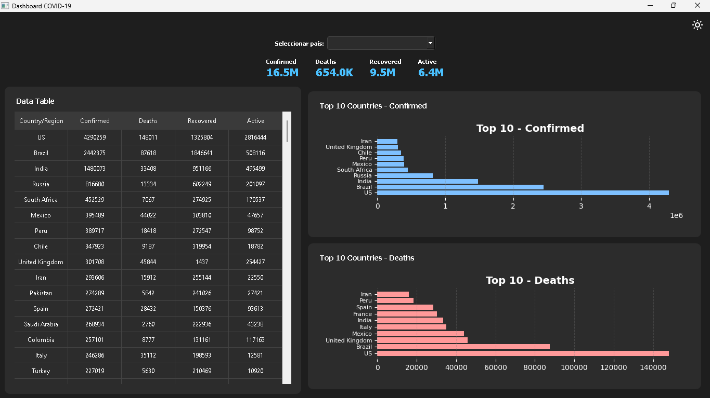
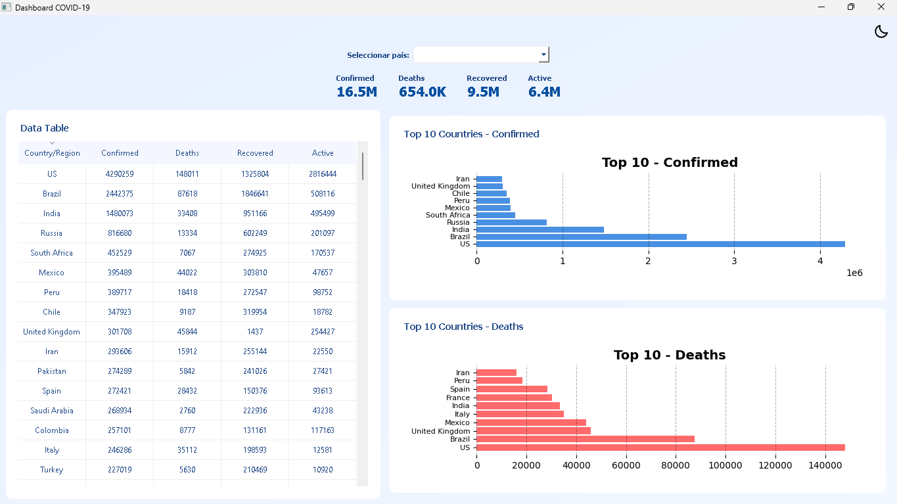

<p align="center">
    
</p>

<h1 align="center">COVID-19 DASHBOARD</h1>

<p align="center">
An interactive Python dashboard for exploring COVID-19 statistics with support for light/dark mode and responsive layouts.
</p>

## Overview

The COVID-19 Dashboard is a Python-based data visualization tool built with PyQt5 and Matplotlib. It allows users to interactively explore COVID-19 data through dynamic charts, KPIs, and trends.

## Features

* Light/Dark Theme Toggle — switch seamlessly between light and dark modes.
* Dynamic Charts & KPIs — visual updates and smooth animations.
* Responsive Layout — adapts to different screen sizes.
* CSV Data Integration — load and visualize your own datasets easily.
* Customizable Dashboard — easily extendable for new charts and KPIs.

## Technologies Used

* Python 3.10+
* PyQt5 (GUI Framework)
* Matplotlib (Charts & Visualizations)
* Pandas (Data Manipulation)
* Colorama (Terminal Colors, optional for logs)

## Setup Instructions

1.Clone the repository:

```bash
git clone https://github.com/yourusername/covid19-dashboard.git
cd covid19-dashboard
```

2.Install dependencies:

```bash
pip install -r requirements.txt
```

3.Run the dashboard:

```bash
python main.py
```

## Data Source

The dashboard reads data from:

```bash
data/dataset.csv
```

Ensure your CSV contains at least these columns:

* Date
* Confirmed Cases
* Recovered
* Deaths

## Example Visualizations

The dashboard displays KPIs and charts such as:

* Total confirmed vs recovered cases
* Death rates over time
* Daily case trends

<p align="center">
    <b>Dark Mode</b><br>
    <br><br>
    <b>Light Mode</b><br>
    
</p>

## Author

Developed by Bytech Technology, 2025. Contributions, suggestions, and feedback are welcome!

## License

This project is licensed under the MIT License.
